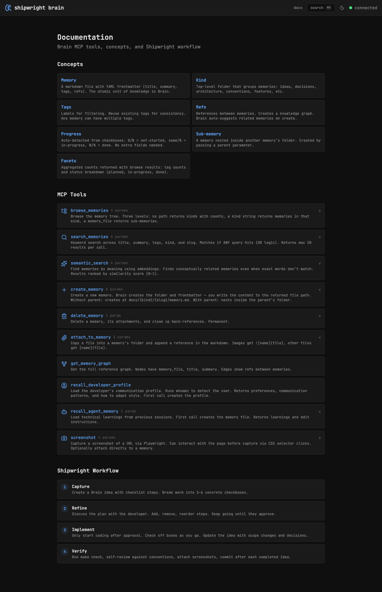

# Shipwright Brain UI

Web UI for [Shipwright Brain](https://github.com/shipwright-ai/shipwright-brain) — browse, search, and read memories stored in Brain's knowledge base.

Part of the [Shipwright](https://github.com/shipwright-ai/shipwright) ecosystem for AI-assisted software development.


## Features

- **Browse** memories by kind (ideas, decisions, architecture, etc.) with tag and status filters
- **Search** with full-text keyword search and Cmd+K command palette
- **Memory detail** with rendered markdown, progress tracking, and image lightbox
- **Documentation** page showing Brain MCP tools, concepts, and Shipwright workflow
- **Dark/light/system** theme support
- **Status dashboard** with planned/in-progress/done counts




## Prerequisites

- [Node.js](https://nodejs.org/) 18+
- A running [Shipwright Brain](https://github.com/shipwright-ai/shipwright-brain) server (defaults to `http://localhost:3111`)

## Getting Started

```bash
# Clone the repo
git clone git@github.com:shipwright-ai/shipwright-ui.git
cd shipwright-ui

# Install dependencies
npm install

# Start the dev server
make dev
```

The UI will be available at `http://localhost:5173`.

## Commands

```
make dev        # Start dev server (localhost:5173)
make check      # Lint + typecheck (run before every commit)
make test       # Run unit tests
make format     # Auto-format with prettier
make build      # Production build
make help       # Show all targets
```

## Stack

- **Framework:** SvelteKit 2 + Svelte 5 (runes mode)
- **Language:** TypeScript (strict)
- **Styling:** Tailwind CSS 4 + shadcn-svelte
- **Font:** JetBrains Mono
- **Icons:** Lucide
- **Markdown:** marked + marked-highlight
- **Testing:** Vitest

## Brain MCP Integration

Brain UI connects to a Shipwright Brain server via its HTTP API. To use Brain as an MCP server in your project (for AI agents like Claude Code), add to your `.mcp.json`:

```json
{
	"mcpServers": {
		"brain": {
			"command": "npx",
			"args": ["shipwright-brain", "mcp", "--dir", "./docs"]
		}
	}
}
```

## Related Projects

- [Shipwright](https://github.com/shipwright-ai/shipwright) — methodology and skills for AI-assisted development
- [Shipwright Brain](https://github.com/shipwright-ai/shipwright-brain) — persistent knowledge base with MCP server
