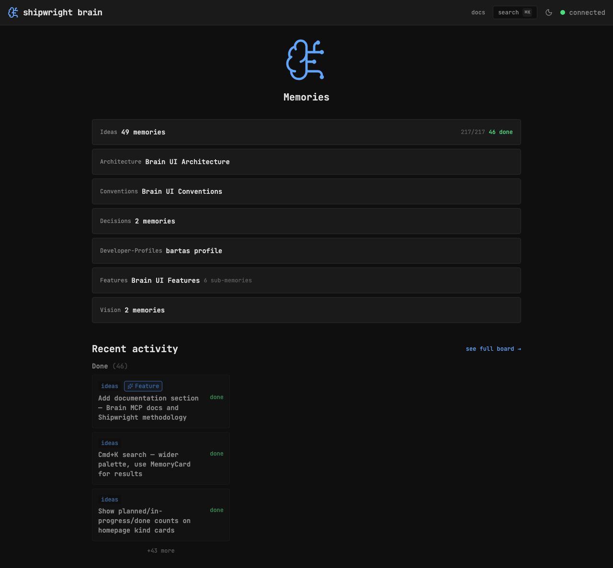
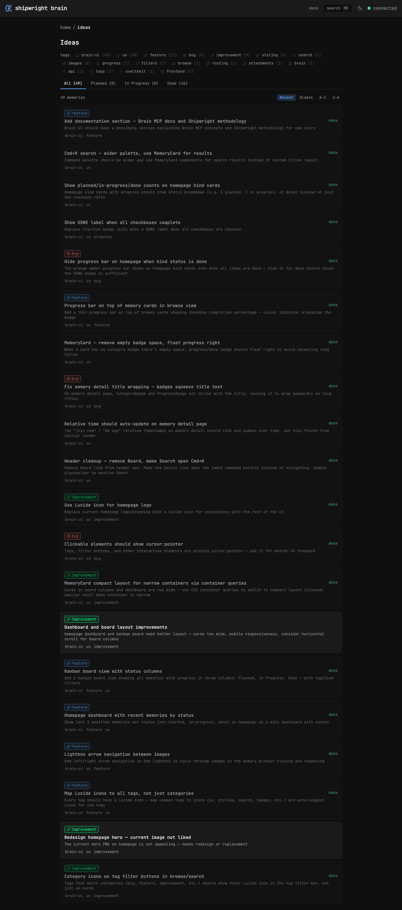
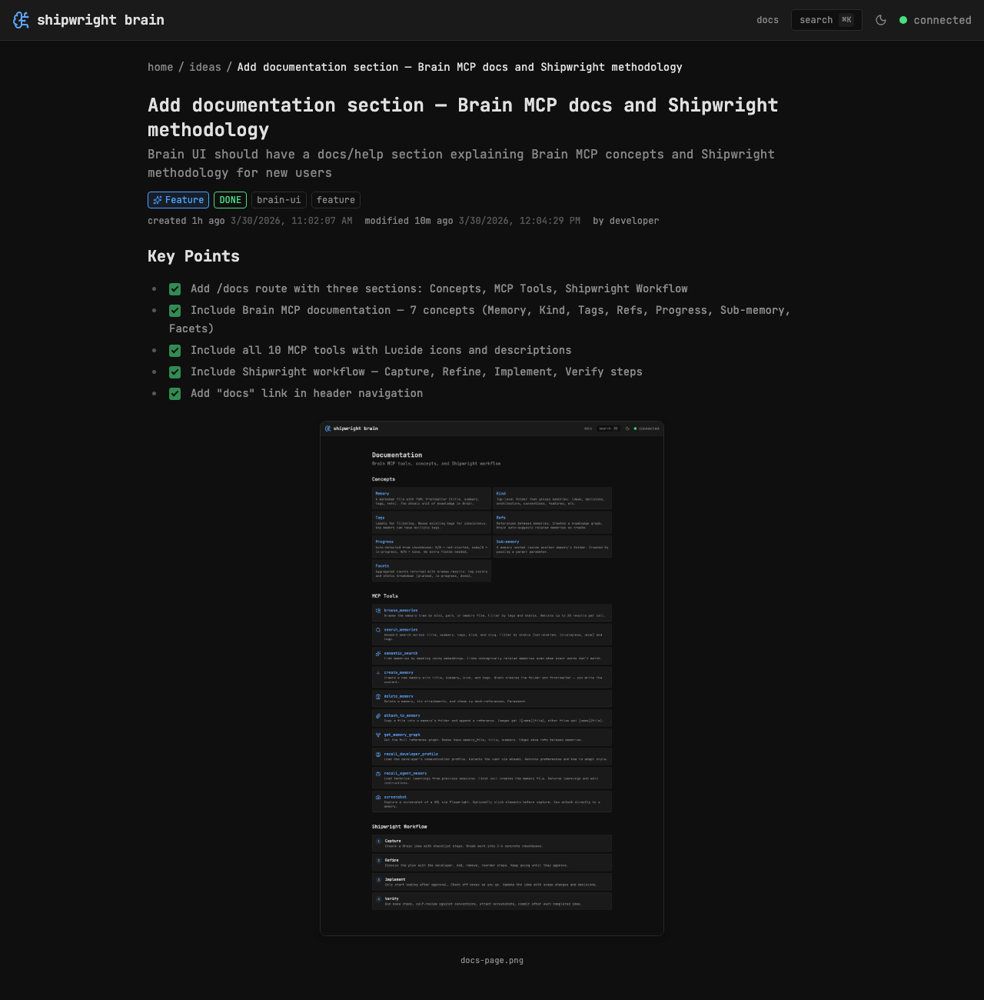

# Shipwright UI

Web UI for [Shipwright Brain](https://github.com/shipwright-ai/shipwright-brain) — browse, search, and read your project's knowledge base.

Part of the [Shipwright](https://github.com/shipwright-ai/shipwright) a la carte toolkit.



## Install

### Quick start (no clone needed)

```bash
npx github:shipwright-ai/shipwright-ui
```

Options:

```bash
npx github:shipwright-ai/shipwright-ui --port 8080        # UI on custom port (default: 5173)
npx github:shipwright-ai/shipwright-ui --brain-port 4000   # Brain API on custom port (default: 3111)
npx github:shipwright-ai/shipwright-ui -p 8080 -b 4000     # both
```

Requires a running Brain MCP server.

### Via Makefile (recommended)

If [Shipwright](https://github.com/shipwright-ai/shipwright) set up your project, just run:

```bash
make brain-ui
```

### For development

```bash
git clone git@github.com:shipwright-ai/shipwright-ui.git
cd shipwright-ui
npm install
make dev
```

Dev server at http://localhost:5173.

## Features

- **Browse** memories by kind (ideas, decisions, features, etc.) with tag and status filters
- **Search** with full-text keyword search and Cmd+K command palette
- **Priority badges** — colored icons for `priority/low` through `priority/blocker` tags, shown next to titles
- **Memory detail** with rendered markdown, syntax highlighting, progress badges, and image lightbox
- **Status dashboard** with planned / in-progress / done counts
- **Dark/light/system** theme support
- **Auto-refresh** as Claude works





## Commands

```
make dev        # Start dev server (localhost:5173)
make check      # Lint + typecheck
make test       # Run unit tests
make format     # Auto-format with prettier
make build      # Production build
make help       # Show all targets
```

## Stack

- **Framework:** SvelteKit 2 + Svelte 5 (runes mode)
- **Language:** TypeScript (strict)
- **Styling:** Tailwind CSS 4 + shadcn-svelte
- **Font:** JetBrains Mono
- **Icons:** Lucide
- **Markdown:** marked + marked-highlight
- **Testing:** Vitest

## Related Projects

- [Shipwright](https://github.com/shipwright-ai/shipwright) — a la carte toolkit for Claude Code (methodology + orchestration)
- [Shipwright Brain](https://github.com/shipwright-ai/shipwright-brain) — persistent memory with MCP server

## License

MIT
