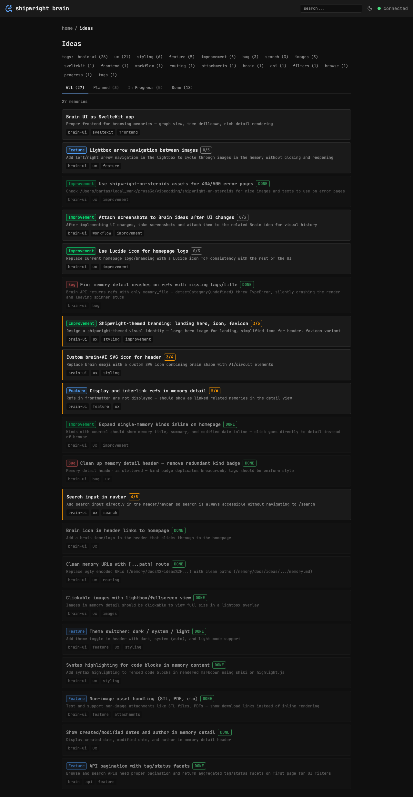

## Route

`/browse/[...path]` — file: `src/routes/browse/[...path]/+page.svelte`

## Capabilities

- **Kind listing** — homepage shows all memory kinds with counts, progress bars, and dashboard
- **Memory cards** — shared MemoryCard component with title, summary, category badge, progress bar, tags
- **Status filters** — filter by All / Planned / In Progress / Done with counts
- **Tag filters** — clickable tag facets with Lucide icons, counts, multi-select support
- **Sort controls** — Recent / Oldest / A-Z / Z-A, persisted in URL
- **Category badges** — color-coded badges with Lucide icons for bug, feature, improvement, epic, research, chore
- **Progress bars** — thin colored bar at top of cards (amber=in-progress, green=done)
- **Pagination** — "load more" button when results exceed page size
- **Empty state** — shipwright illustration when no memories match filters
- **Single-kind expansion** — kinds with count=1 expand inline on homepage
- **Homepage dashboard** — recent memories by status (Planned/In Progress/Done) with counts

