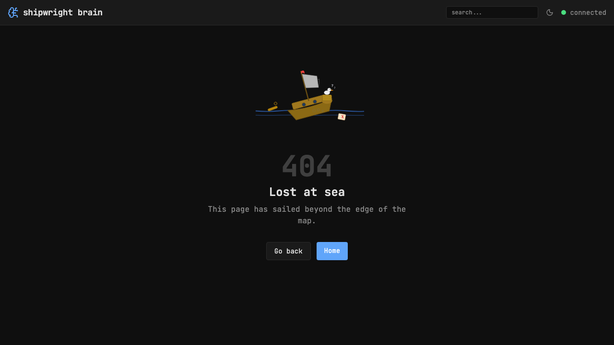
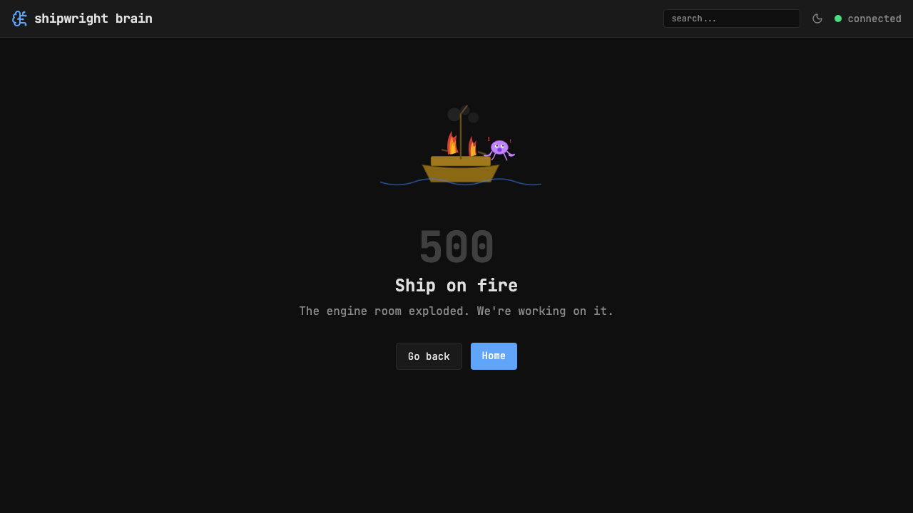

## Files

- `src/routes/+error.svelte` — SvelteKit error page
- `static/error-404.svg` — sinking ship with confused seagull
- `static/error-500.svg` — ship on fire with panicking octopus
- `static/error-generic.svg` — ship stuck on rocks with crab holding wrench
- `src/routes/debug/test-error/+page.server.ts` — test page (`?code=404`, `?code=500`)

## Capabilities

- **404 page** — "Lost at sea" with sinking ship SVG, animated waves and bubbles
- **500 page** — "Ship on fire" with burning ship SVG, smoke puffs, panicking octopus
- **Generic errors** — "Ran aground" with ship-on-rocks SVG, animated crab
- **Navigation** — Go Back + Home buttons on all error pages
- **Empty states** — shipwright illustrations on browse (no filter matches), search (no results), and home (brain empty)
- **Deleted refs** — red border, "deleted" badge, strikethrough text for unresolved refs
- **Memory not found** — red error box when Brain API returns 404

