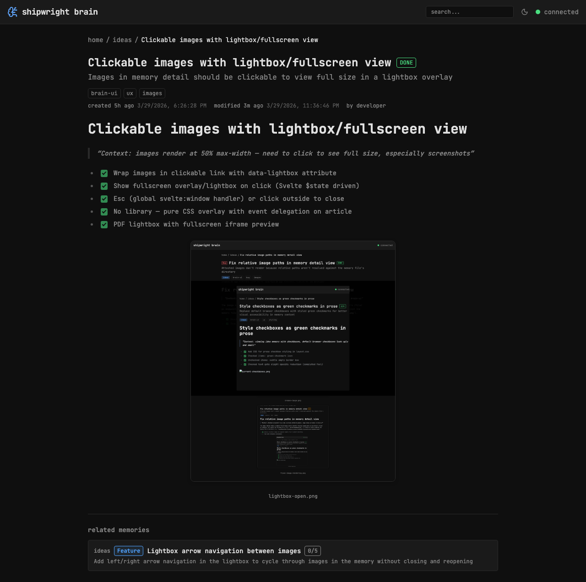

## Route

`/memory/[...path]` — file: `src/routes/memory/[...path]/+page.svelte`

## Capabilities

- **Markdown rendering** — full markdown via marked with GFM support
- **Syntax highlighting** — fenced code blocks highlighted with highlight.js (JS, TS, Python, Bash, JSON, YAML, CSS, HTML, Svelte)
- **Image lightbox** — click images to view full size in overlay, Escape to close
- **Related memories (refs)** — linked cards with category badges and progress; deleted refs show red border + "deleted" badge + strikethrough
- **Attachment cards** — non-image files shown as download cards with type icons; PDFs open in lightbox preview
- **Progress badges** — checkbox progress (e.g. 5/6) or DONE label when complete
- **Dates** — created and modified dates with relative time + exact timestamp tooltip
- **Breadcrumbs** — home / kind / title navigation
- **Clickable tags** — click any tag to search by it
- **Sub-memories** — children listed below content with title, summary, and progress
- **Inline code** — rendered as accent-colored text without visible backticks
- **Checkbox styling** — green checkmarks, completed items dimmed

