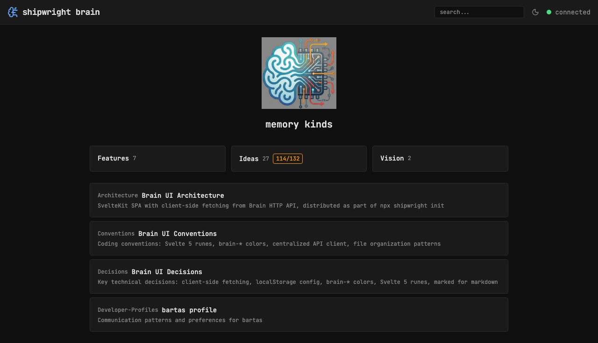
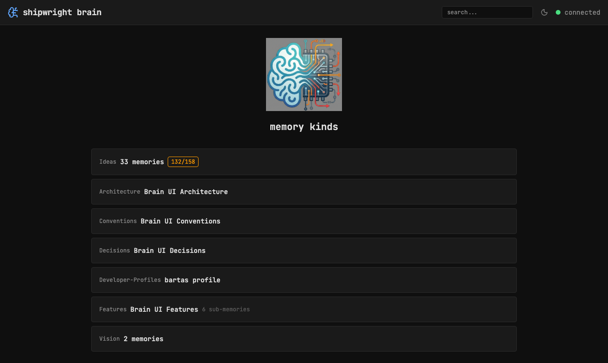

## Components

- `src/lib/components/Header.svelte`
- `src/lib/components/CommandPalette.svelte`

## Capabilities

- **Header** — sticky top bar with brain icon (links to home), "shipwright brain" title, board link, inline search input, theme toggle, connection status dot (green=connected, red=disconnected)
- **Breadcrumbs** — full path hierarchy derived from memory_file, nested memories show all parent segments
- **Command palette** — Cmd+K opens search overlay for quick navigation
- **Theme switcher** — cycles dark / system / light with icon indicator
- **Clean URLs** — `/memory/docs/ideas/foo/memory.md` instead of encoded paths
- **Board link** — direct link to kanban board in header

