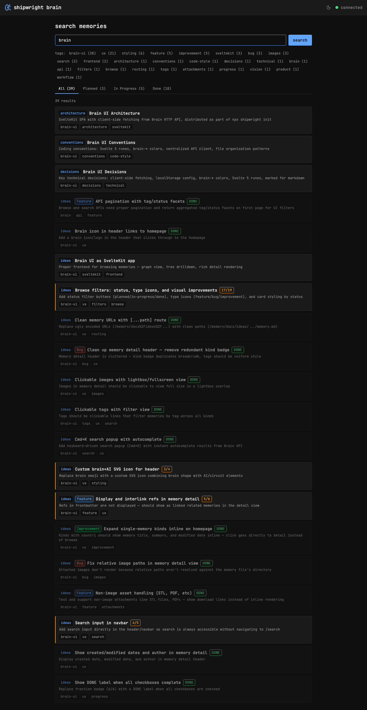

## Route

`/search` — file: `src/routes/search/+page.svelte`

## Capabilities

- **Full-text search** — queries Brain's search API, auto-focuses input on page load
- **URL params** — supports `?q=` for query, `?tags=a,b` and `?tag=a&tag=b` formats
- **Tag filtering** — tag facets with counts, clickable to toggle filter
- **Status filtering** — All / Planned / In Progress / Done tabs
- **Result cards** — same card style as browse with category badges, progress, timestamps
- **Empty state** — sinking ship illustration when no results found
- **Header search** — inline search input in navbar redirects to /search

