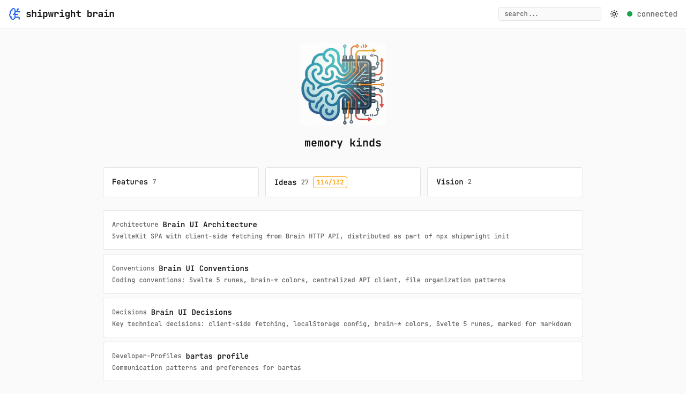

## Files

- `src/routes/layout.css` — color tokens, prose overrides, checkbox/image styling
- `src/app.css` — Tailwind config with brain-\* custom colors
- `static/error-*.svg` — animated shipwright-themed illustrations

## Capabilities

- **Dark mode** — default theme, zinc-based palette with brain-\* color tokens
- **Light mode** — inverted palette, all components adapt
- **System mode** — follows OS preference via prefers-color-scheme
- **Color tokens** — brain-bg, brain-surface, brain-border, brain-text, brain-muted, brain-accent, brain-green, brain-red
- **JetBrains Mono** — monospace font across the entire UI
- **Shipwright illustrations** — hand-crafted animated SVGs with transparent backgrounds (work on both dark and light)
- **Prose styling** — customized markdown rendering colors, checkbox green checkmarks, image borders with lightbox, inline code as plain accent text

