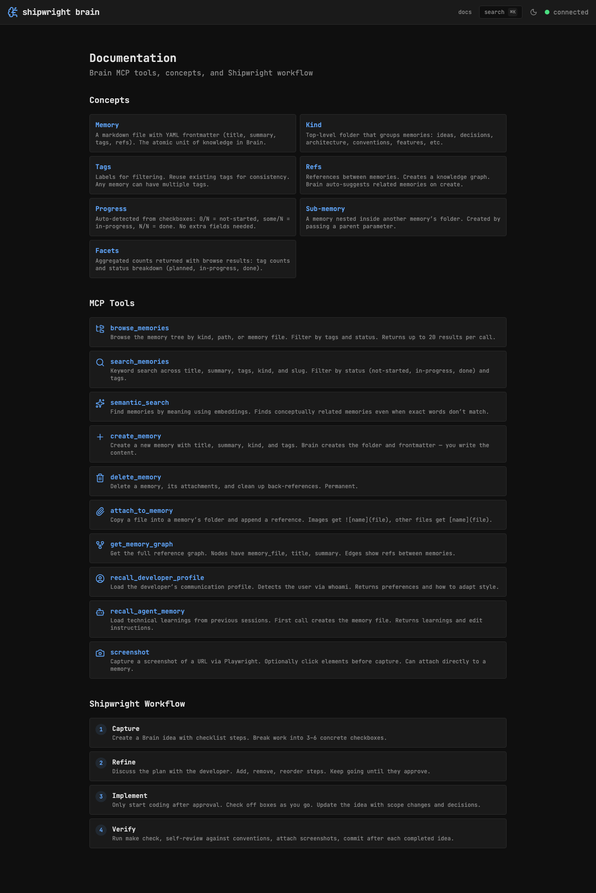

## Key Points

- [x] Add /docs route with three sections: Concepts, MCP Tools, Shipwright Workflow
- [x] Include Brain MCP documentation — 7 concepts (Memory, Kind, Tags, Refs, Progress, Sub-memory, Facets)
- [x] Include all 10 MCP tools with Lucide icons and descriptions
- [x] Include Shipwright workflow — Capture, Refine, Implement, Verify steps
- [x] Add "docs" link in header navigation

