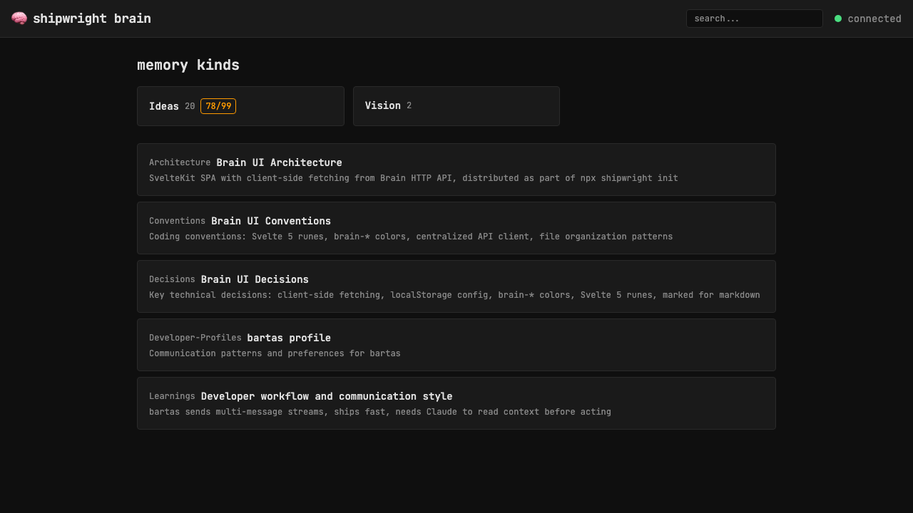

# Brain icon in header links to homepage

> Context: header says "shipwright brain" as text — needs a visual brain icon that links home

- [x] Add brain emoji (🧠) before the title in Header.svelte
- [x] Make it a link to / (homepage)

