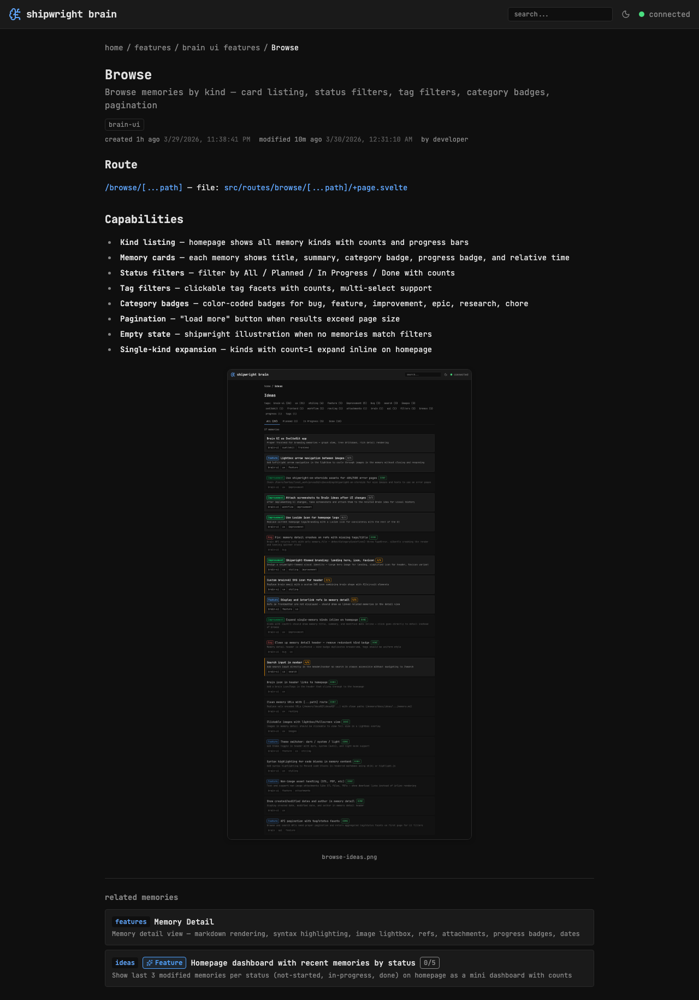

## Background

Sub-memory breadcrumbs currently show `home / features / Browse` but should show `home / features / Brain UI Features / Browse`. The API already returns a `parent` field with the parent's `memory_file` path.

## Fix needed

- [x] Parse full path from memory_file — derive breadcrumb segments by deslugifying path parts
- [x] Show entire path hierarchy in breadcrumbs, not just parent
- [x] Each segment links to its corresponding memory or browse path
- [x] Example: home / features / brain ui features / Browse

