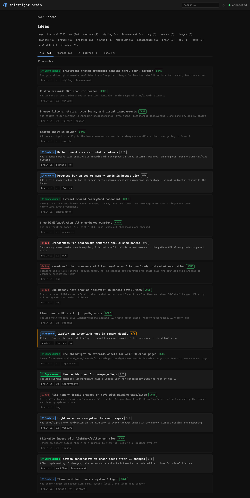

# Browse filters: status, type icons, and visual improvements

> Context: ideas list shows all items equally — need to filter by status and distinguish types visually

## Status filters

- [x] Add status as tab bar below tags: All / Planned / In Progress / Done
- [x] All tabs always visible with counts from tag-filtered facets (cross-filtering)
- [x] Active tab highlighted with status color (underline style)
- [x] Card styling changes by status (done=dimmed, in-progress=amber left border)
- [x] API-driven filtering via Brain's ?status= param (not client-side)
- [x] Second API call only when status is active

## Tag filters

- [x] Tags at top — filter by topic first
- [x] Tag counts from API facets (cascading with status)
- [x] Clickable tags on cards toggle filter
- [x] All filters synced to URL (?tag=x&status=y) for refresh/sharing

## Type badges (from tags)

Tags are the source: bug, feature, improvement, epic, research, chore.
No title prefix stripping — just detect from tags and show colored badge.

- [x] Created categories.ts with detectCategory() from tags
- [x] Created CategoryBadge.svelte shared component
- [x] Show colored badge: red=bug, blue=feature, green=improvement, purple=epic, cyan=research, gray=chore
- [x] Show lucide icon next to badge
- [x] Filter by type in addition to status — categories are tags, already filterable via tag bar
- [x] Add category badges to search results and memory detail

## Visual polish

- [x] Done cards slightly dimmed (opacity-60)
- [x] In-progress cards with amber left border
- [x] Planned cards neutral

