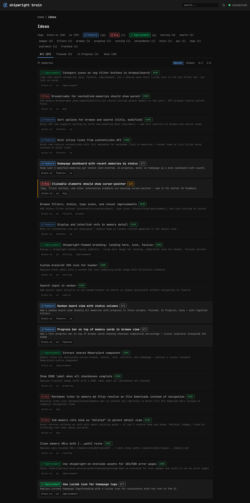

## Key Points

- [x] In tag filter bar, detect if a tag is a category (bug, feature, improvement, etc.)
- [x] If so, render CategoryBadge with Lucide icon instead of plain text
- [x] Applied to both browse and search tag filter bars

