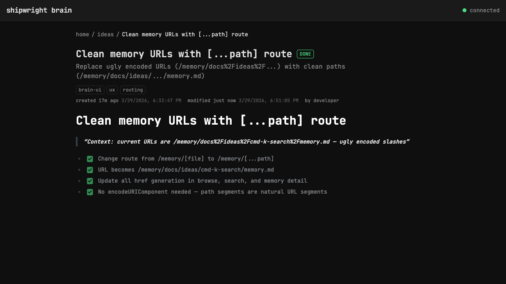

# Clean memory URLs with [...path] route

> Context: current URLs are /memory/docs%2Fideas%2Fcmd-k-search%2Fmemory.md — ugly encoded slashes

- [x] Change route from /memory/[file] to /memory/[...path]
- [x] URL becomes /memory/docs/ideas/cmd-k-search/memory.md
- [x] Update all href generation in browse, search, and memory detail
- [x] No encodeURIComponent needed — path segments are natural URL segments

