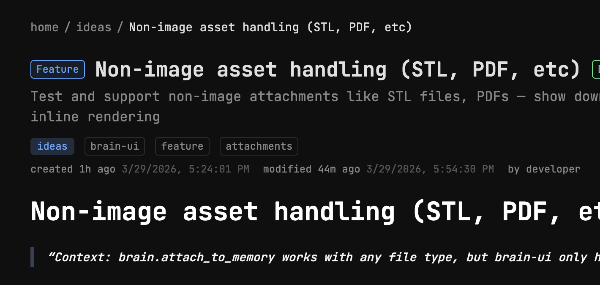
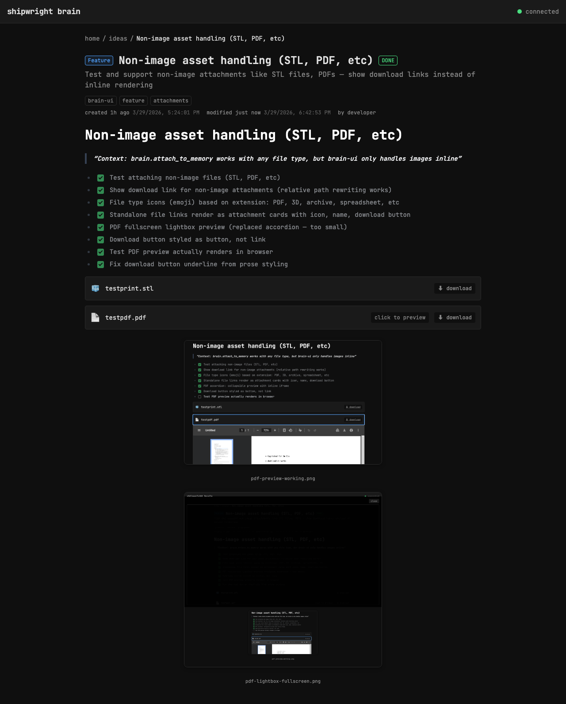

# Clean up memory detail header — remove redundant kind badge

> Context: header has kind badge (blue "ideas") + category badge + tags — kind duplicates breadcrumb

- [x] Remove kind badge from header (already shown in breadcrumb)
- [x] Tags use uniform style (no special accent for kind)

