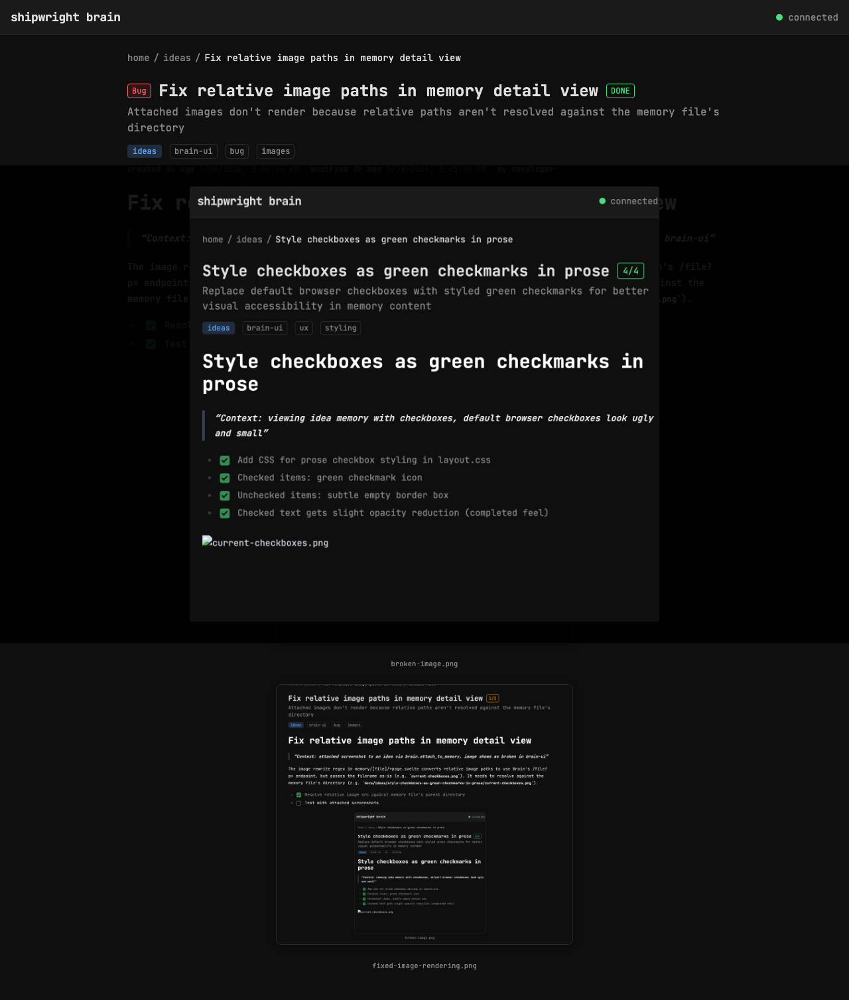

# Clickable images with lightbox/fullscreen view

> Context: images render at 50% max-width — need to click to see full size, especially screenshots

- [x] Wrap images in clickable link with data-lightbox attribute
- [x] Show fullscreen overlay/lightbox on click (Svelte $state driven)
- [x] Esc (global svelte:window handler) or click outside to close
- [x] No library — pure CSS overlay with event delegation on article
- [x] PDF lightbox with fullscreen iframe preview

