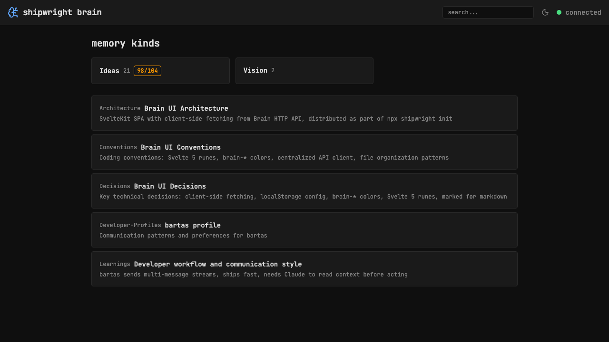

# Cmd+K search popup with autocomplete

> Context: browsing Brain UI, want fast keyboard-driven search like VS Code / Linear

- [x] Add global keydown listener for Cmd+K / Ctrl+K (svelte:window)
- [x] Create CommandPalette.svelte modal overlay with search input
- [x] Debounce input (200ms) and call searchMemories on each keystroke
- [x] Show results with kind badge, category badge, progress badge
- [x] Navigate results with arrow keys, Enter to open, mouse hover
- [x] Esc to close, click outside to dismiss

