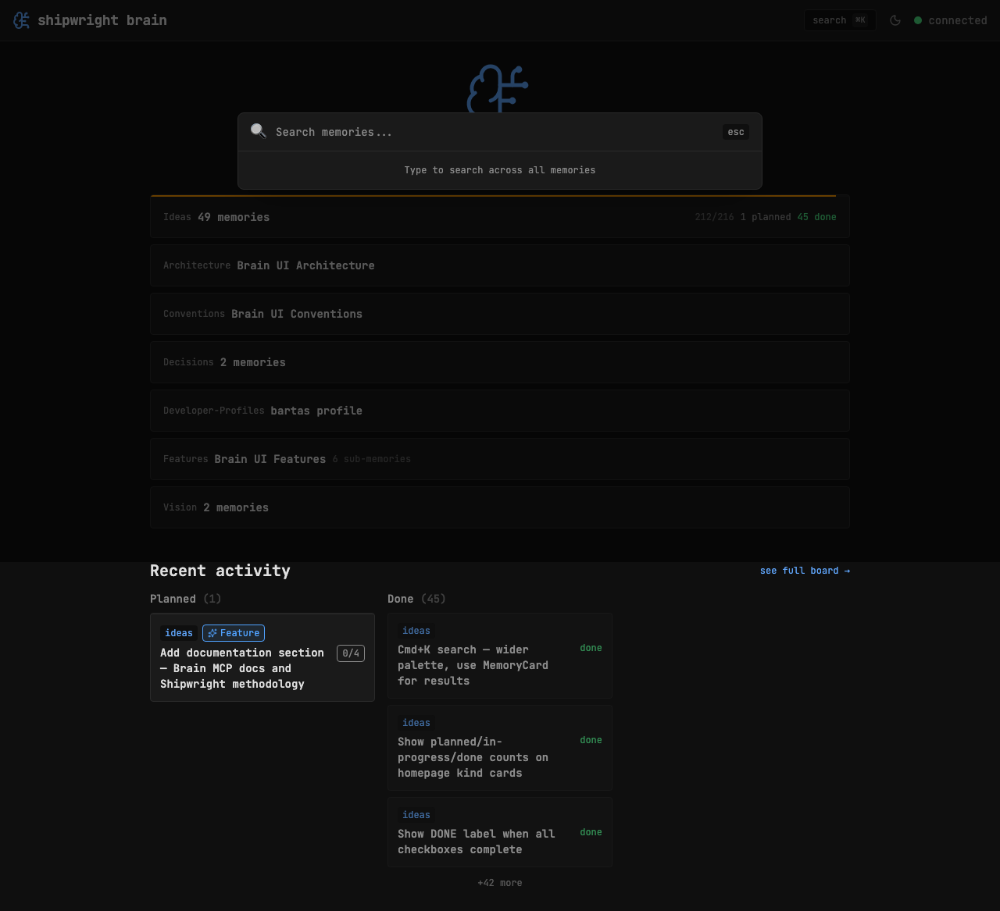

## Key Points

- [x] Widen command palette from max-w-lg to max-w-2xl
- [x] Replace custom result buttons with MemoryCard components (with showKind)
- [x] Taller results area (max-h-[60vh]) to show more results
- [x] Ring highlight on selected result for keyboard navigation

