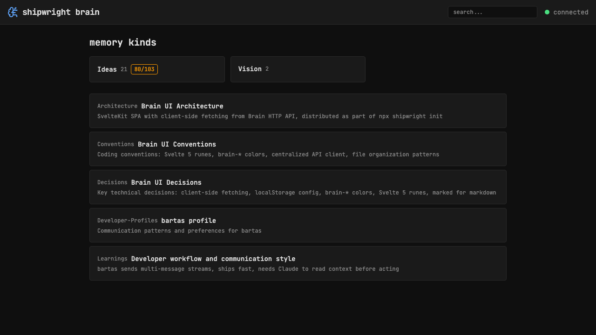

# Custom brain+AI SVG icon for header

> Context: emoji 🧠 works but a custom SVG would be more polished and match the dark theme

- [x] Design SVG: brain silhouette with circuit/node pattern (custom + lucide BrainCircuit)
- [x] Use brain-accent color (#60a5fa) for the icon
- [x] Replace emoji in Header.svelte with lucide BrainCircuit
- [x] Also use as favicon — SVG favicon added to static/favicon.svg

