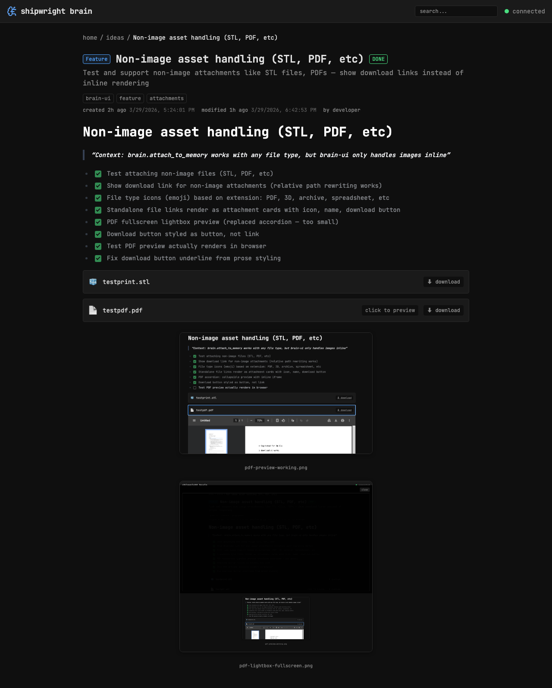
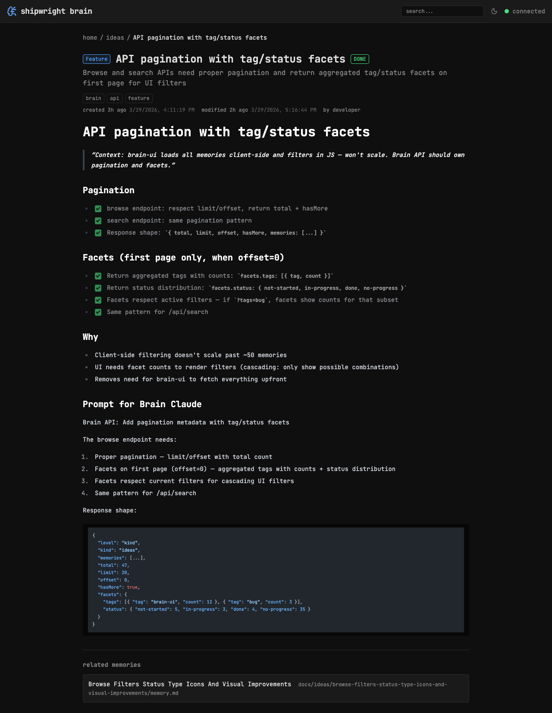
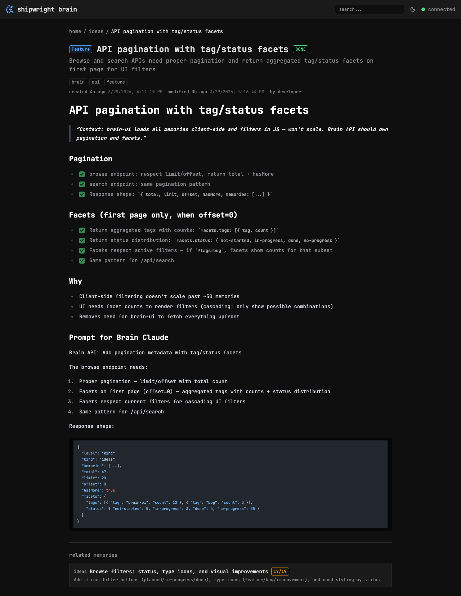

# Display and interlink refs in memory detail

> Context: Brain stores refs (related memory_file paths) in frontmatter but brain-ui doesn't display them

- [x] Show refs section in memory detail (after content, before children)
- [x] Display as linked cards with slug name + full path
- [x] Brain API: return refs as full objects (title, summary, tags, progress, kind)
- [ ] Brain API: return referencedBy (back-refs) — which memories ref this one
- [x] UI: render refs as rich cards with kind, category badge, progress badge
- [x] UI: use full objects from API

