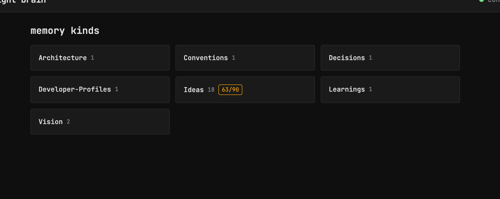
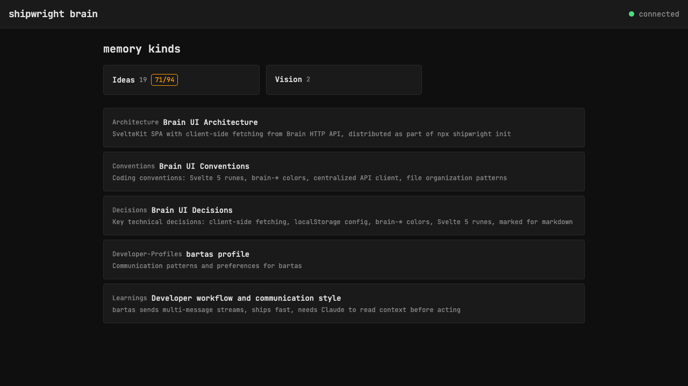

# Expand single-memory kinds inline on homepage

> Context: kinds with 1 memory (Architecture, Conventions, etc) force a useless browse step

## Layout

- Multi-memory kinds (count > 1): show as cards, link to browse (current behavior)
- Single-memory kinds (count = 1): show inline with title, summary, modified date — link directly to memory detail
- Sort: multi-memory kinds first, then singles

## Steps

- [x] Fetch single-memory kind data on homepage (parallel browse calls)
- [x] Render singles as expanded cards with kind label + title + summary
- [x] Link directly to /memory/[...path] instead of /browse
- [x] Sort: multi-memory kinds first (grid), then singles (list)

