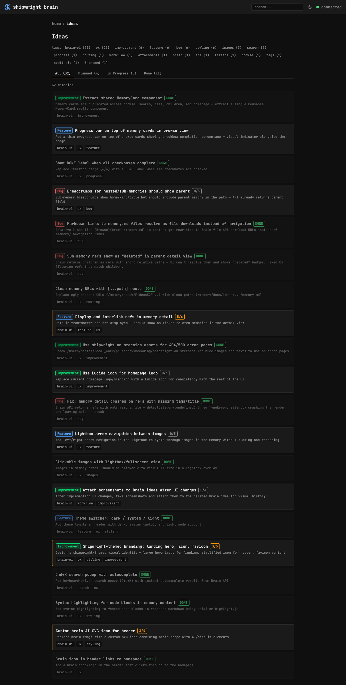
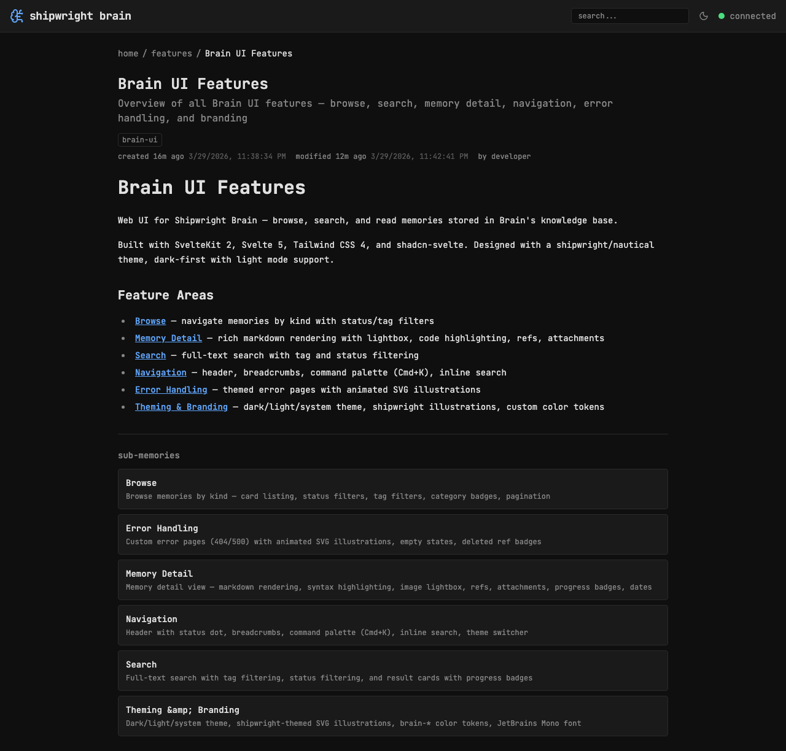

## Background

Memory cards were duplicated across browse, search, refs, children, and homepage — each with slightly different rendering. Extracting a shared component ensures consistent look everywhere.

## Implementation

- [x] Create `src/lib/components/MemoryCard.svelte` with configurable props
- [x] Props: memory, showKind, showTags, activeTags, onToggleTag, deleted
- [x] Replace card in browse page
- [x] Replace card in search page
- [x] Replace refs cards in memory detail
- [x] Replace children cards in memory detail
- [x] Status-based styling: done (dimmed), in-progress (amber left border), deleted (red)
- [x] make check passes

