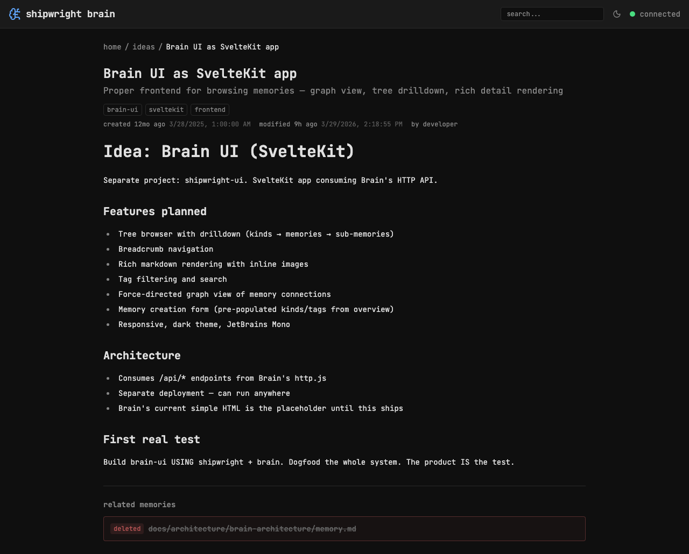
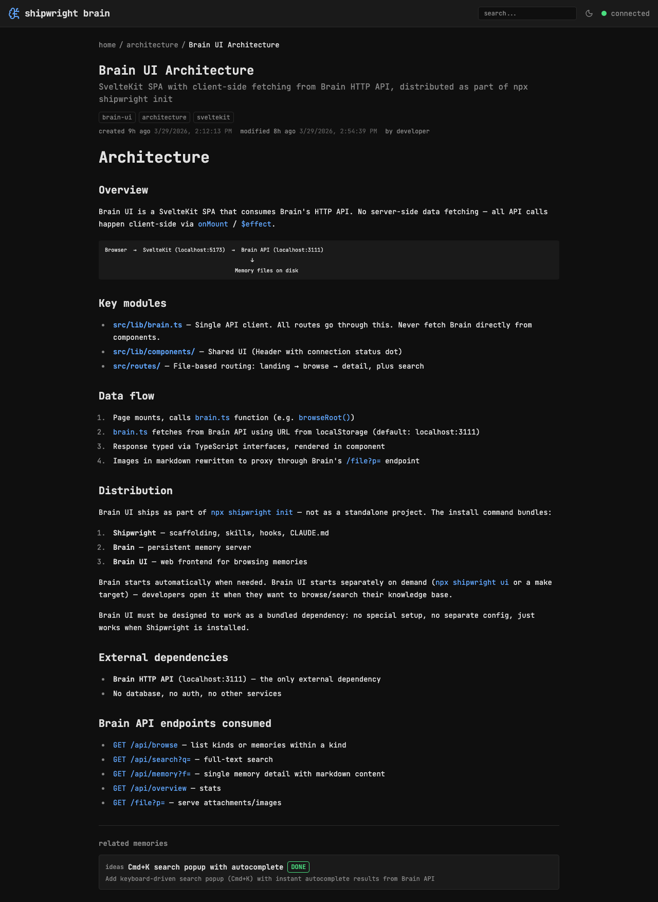

## Background

The memory detail page (`/memory/[...path]`) silently crashes when a memory has refs that are returned from the Brain API with only `memory_file` (no `tags`, `title`, `kind`). The page gets stuck on the loading spinner with no error shown.

## Root Cause

`detectCategory(ref.tags)` in the refs rendering section iterates over `tags` with `for...of`. When `ref.tags` is `undefined`, this throws `TypeError: tags is not iterable`. The error is caught by the `load()` try/catch but the entry was already set, so the page stays in a limbo state showing only the spinner.

## Fix

- [x] `detectCategory()` now accepts `string[] | undefined` and returns `null` for missing tags
- [x] Refs display guards against missing `kind` with `{#if ref.kind}`
- [x] Falls back to `ref.memory_file` when `title` is missing: `ref.title ?? ref.memory_file`
- [x] `make check` passes (0 errors)

## Files Changed

- `src/lib/categories.ts` — guard for undefined tags
- `src/routes/memory/[...path]/+page.svelte` — defensive rendering for incomplete ref data

## References

- Related: docs/ideas/display-and-interlink-refs-in-memory-detail/memory.md

