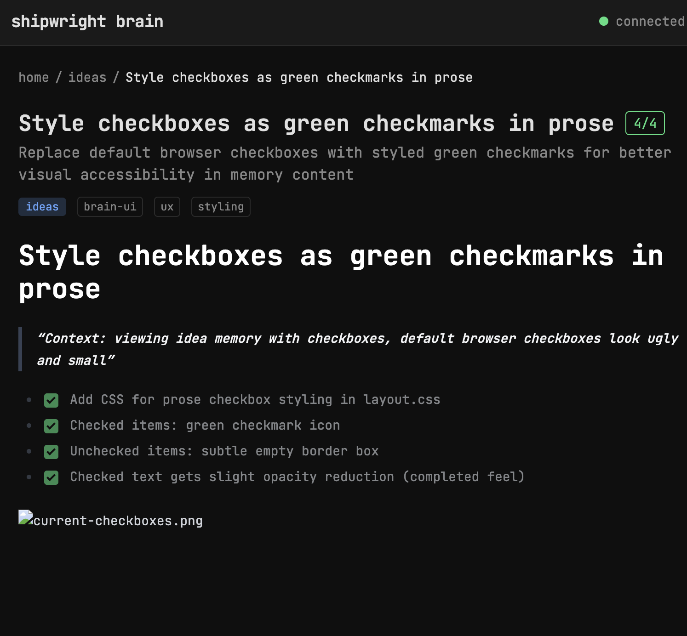

# Fix relative image paths in memory detail view

> Context: attached screenshot to an idea via brain.attach_to_memory, image shows as broken in brain-ui

The image rewrite regex in memory/[file]/+page.svelte converts relative image paths to use Brain's /file?p= endpoint, but passes the filename as-is (e.g. `current-checkboxes.png`). It needs to resolve against the memory file's directory (e.g. `docs/ideas/style-checkboxes-as-green-checkmarks-in-prose/current-checkboxes.png`).

- [x] Resolve relative image src against memory file's parent directory
- [ ] Test with attached screenshots

