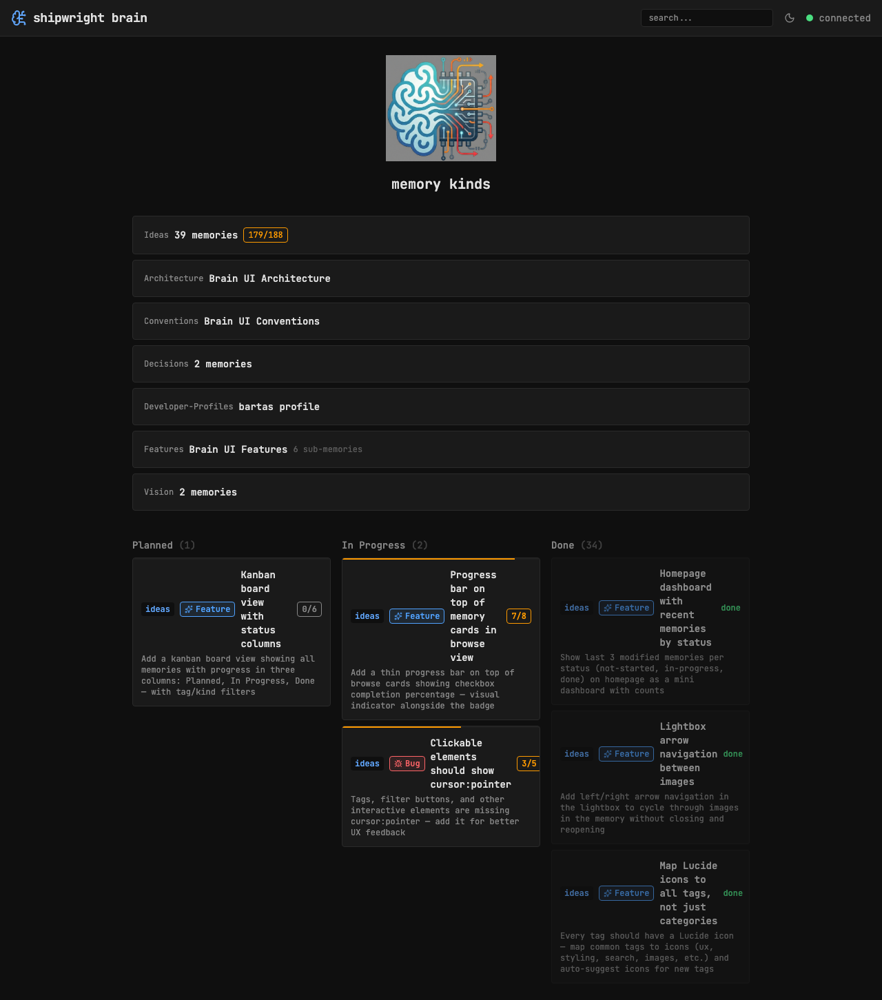

## Key Points

- [x] Fetch 3 most recently modified memories per status (not-started, in-progress, done)
- [x] Uses searchMemories with sort=modified:desc + status filter
- [x] Show as three columns on homepage below the kind list
- [x] Each section shows label + count + up to 3 MemoryCards with kind badge
- [x] Responsive — stacks on mobile (grid-cols-1 md:grid-cols-3)

