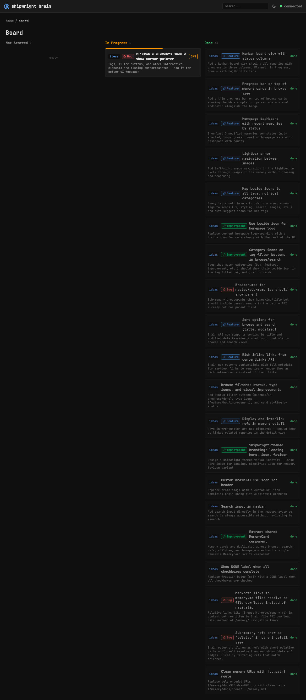

## Background

All memories with checkboxes have a status (planned/in-progress/done). A kanban board view would give a project management overview — see what's planned, what's being worked on, and what's complete at a glance.

## Key Points

- [x] New route `/board`
- [x] Three columns: Not Started, In Progress, Done
- [x] Each column shows MemoryCard components with kind badge
- [x] Filter by tags with TagIcon
- [x] Fetch all memories with status using search API + sort=modified:desc
- [x] Responsive — stacks on mobile (grid-cols-1 md:grid-cols-3)

