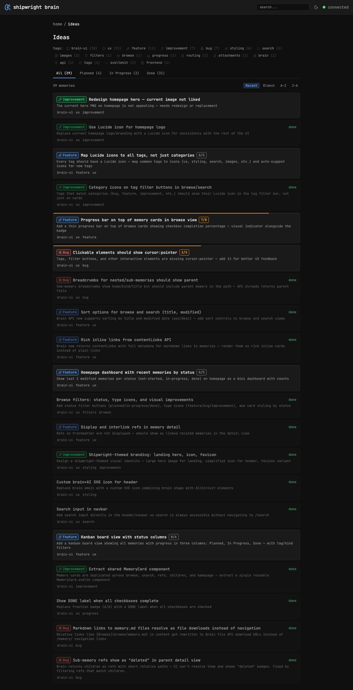

## Key Points

- [x] Created TAG_ICON_MAP in tagIcons.ts mapping tag names to Lucide icon names
- [x] Created TagIcon.svelte component that renders icon by tag name
- [x] Applied to browse and search tag filter bars
- [x] Icons rendered at 40% opacity to not compete with text
- [x] Counts also at 40% opacity for cleaner look
- [x] Fallback: no icon if no match

