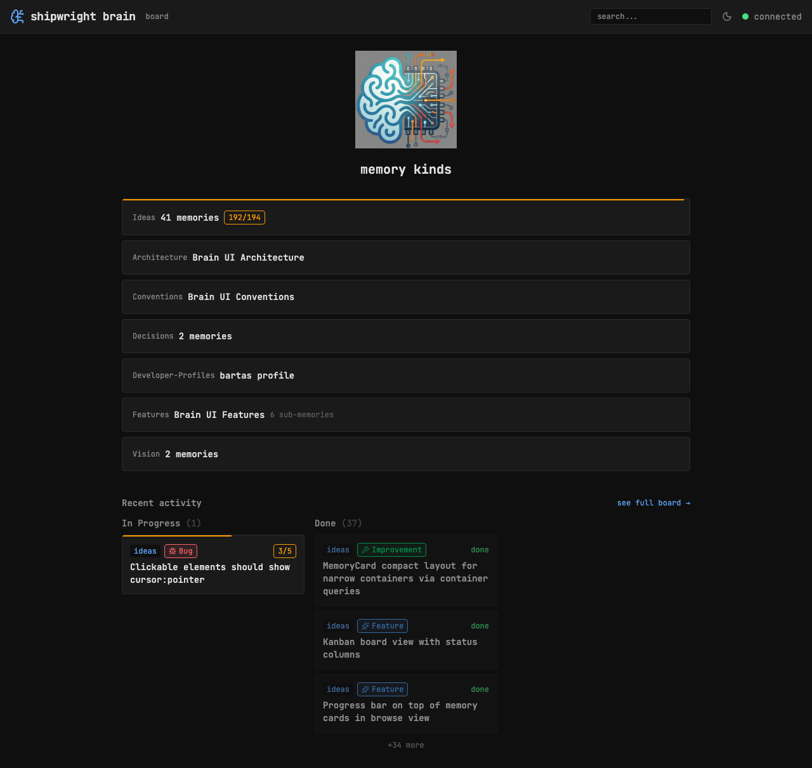
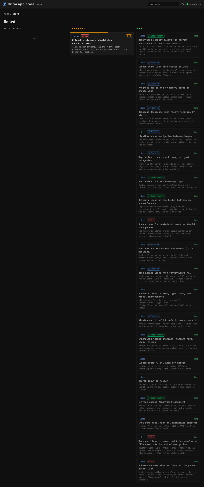

## Key Points

- [x] Add `.card-container` with `container-type: inline-size` on board columns and dashboard
- [x] Use `@container (max-width: 350px)` to hide summary in narrow containers
- [x] Restructured card: badges + progress on first row, title on second row
- [x] Kind + category on left, progress/done on right with flex spacer
- [x] Full layout preserved for browse/search where cards have full width
- [x] Pure CSS — no prop needed

