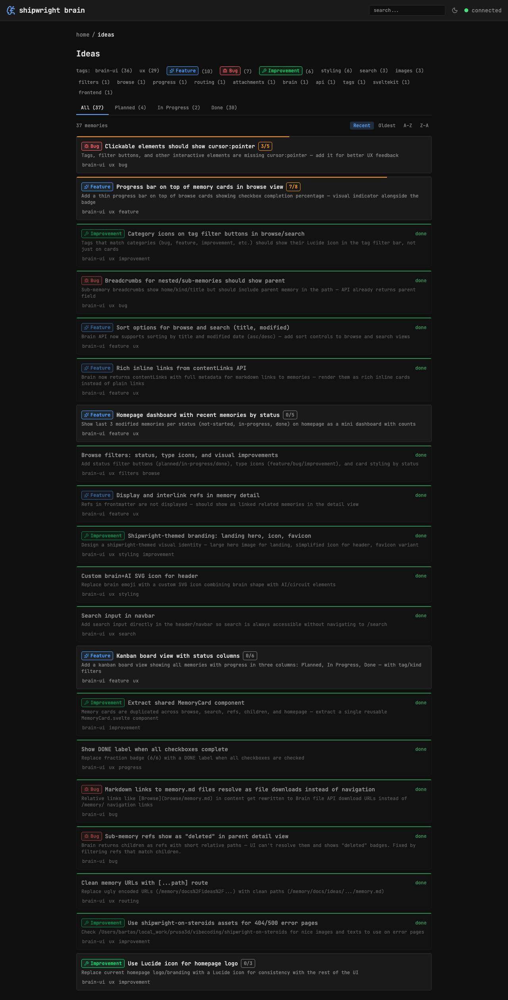

## Background

Cards with progress badges show a fraction like 5/6 but lack a visual bar. A thin progress bar on top of each card would give an instant visual sense of completion.

## Key Points

- [x] Add thin colored bar at top of MemoryCard when progress exists
- [x] Color: green for done, amber for in-progress, gray for not-started
- [x] Width proportional to checked/total percentage
- [x] Also applicable to homepage — dashboard shows status counts + cards per status
- [x] Subtle — should not dominate the card
- [x] Remove redundant amber left border for in-progress (progress bar replaces it)
- [x] Done cards show "done" text on right side instead of DONE badge
- [x] Clean up tag styling — no bg/border on inactive tags

