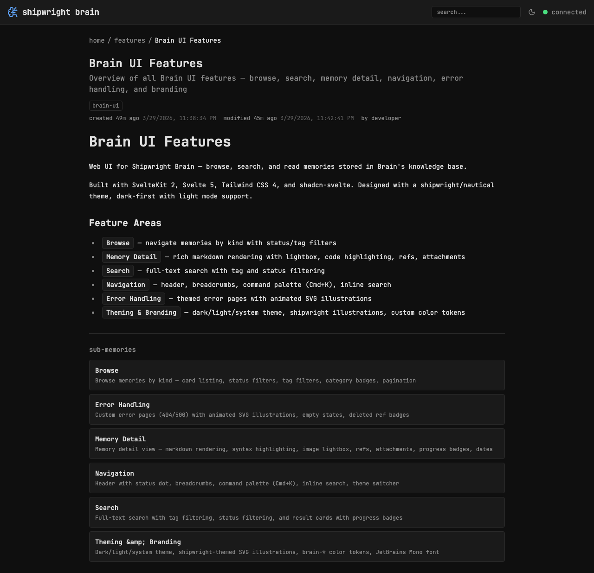

## Background

Brain's memory GET API now returns `contentLinks` — an array of rich metadata for any markdown links to other memories found in the content body. This replaces the need for regex-based link rewriting.

## API Response

```json
{
	"contentLinks": [
		{
			"label": "auth decision",
			"memory_file": "docs/decisions/auth-flow/memory.md",
			"title": "Auth flow decision",
			"summary": "We chose JWT with refresh tokens",
			"kind": "decisions",
			"progress": null,
			"deleted": false
		}
	]
}
```

## Key Points

- [x] Add `contentLinks` to `MemoryDetail` type in brain.ts
- [x] After markdown rendering, replace memory.md links with rich inline cards
- [x] Use contentLinks metadata to show title, kind, progress inline
- [x] Handle deleted links — fall back to plain navigation link
- [x] Integrate with existing regex rewriter — contentLinks enriches memory.md links


