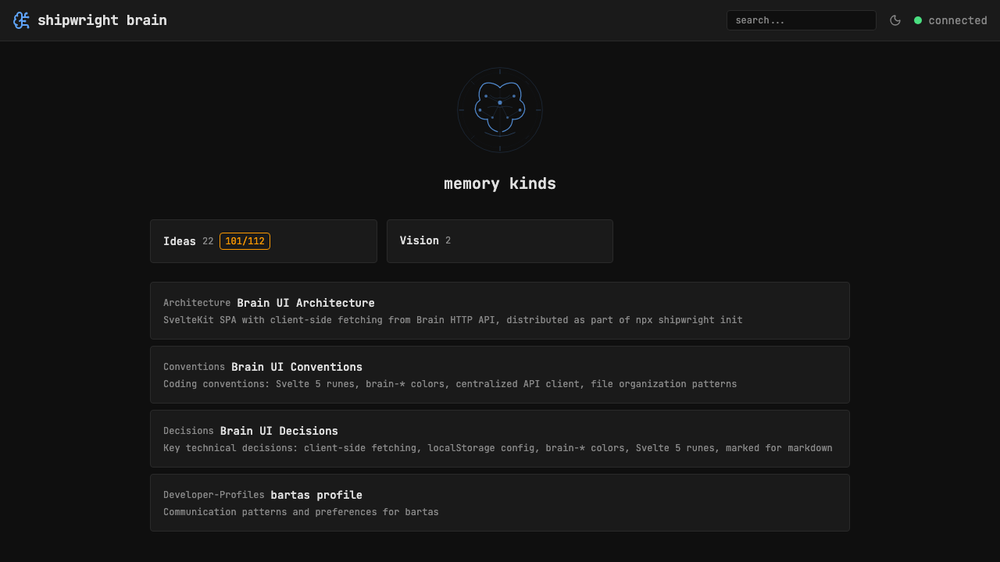

# Shipwright-themed branding: landing hero, icon, favicon

> Context: current BrainCircuit icon is generic — needs shipwright identity. Three sizes of the same concept.

## Concept

Shipwright = ship builder + brain/AI. Visual: brain with ship/compass/anchor elements.
One design, three scales:

1. **Landing hero** — large, detailed SVG on homepage above the kinds grid
2. **Header icon** — simplified version for navbar (current BrainCircuit replacement)
3. **Favicon** — minimal 16x16/32x32 variant

## Steps

- [x] Design SVG hero image: brain + compass circle + circuit nodes + ship keel
- [ ] Simplify for header icon (24x24) — replace BrainCircuit
- [x] Favicon uses hero SVG
- [x] Add hero to landing page above "memory kinds"
- [ ] Iterate on design based on feedback

