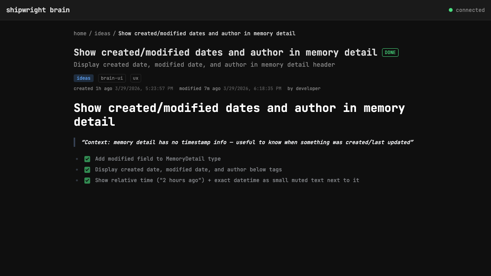

# Show created/modified dates and author in memory detail

> Context: memory detail has no timestamp info — useful to know when something was created/last updated

- [x] Add modified field to MemoryDetail type
- [x] Display created date, modified date, and author below tags
- [x] Show relative time ("2 hours ago") + exact datetime as small muted text next to it

