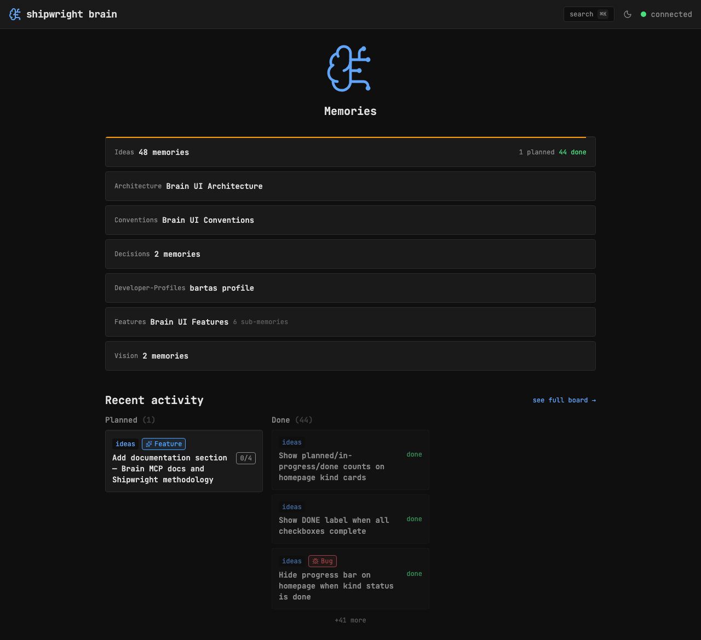

## Key Points

- [x] Fetch per-kind facets for kinds with progress (browseKind returns status facets)
- [x] Show "X planned", "X active", "X done" right-aligned on kind cards — color-coded
- [x] Only show for multi-memory kinds with progress data

