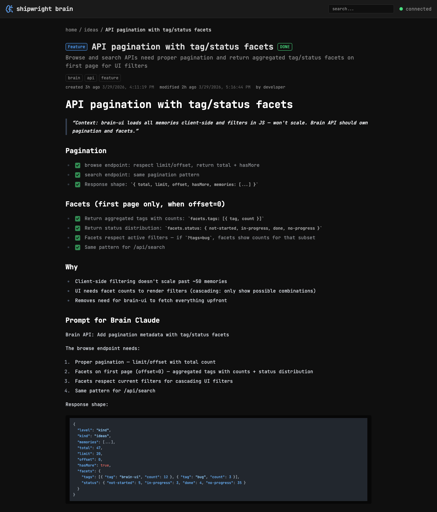

# Syntax highlighting for code blocks in memory content

> Context: code blocks in memory markdown render as plain monospace text with no highlighting

- [x] Choose highlighting library: highlight.js (runtime, tree-shakeable)
- [x] Integrate with marked via marked-highlight plugin
- [x] Dark theme: github-dark-dimmed (matches brain-\* palette)
- [x] Languages: js, ts, python, bash, json, yaml, markdown, css, html, xml, svelte

