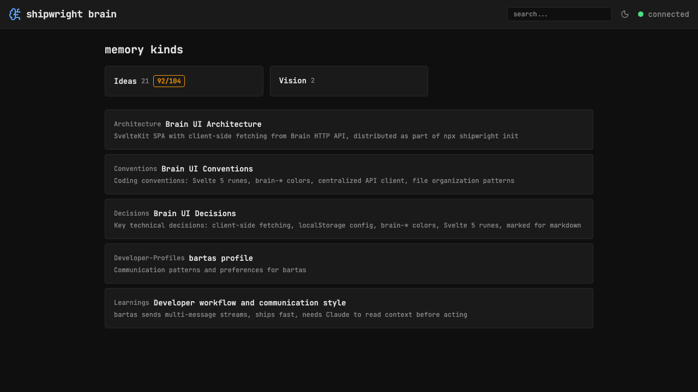
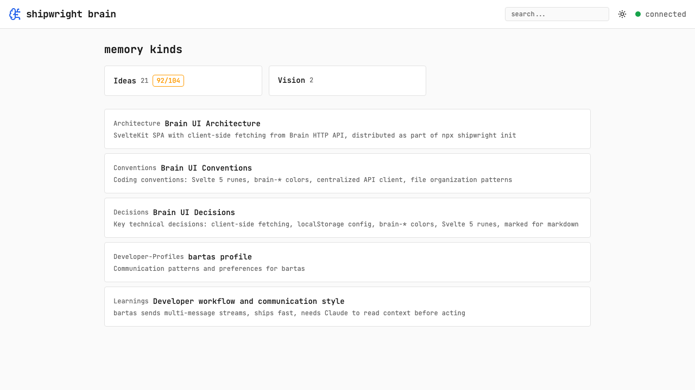

# Theme switcher: dark / system / light

> Context: brain-ui is dark-only — need system preference support and manual toggle

- [x] Add theme toggle button in header — cycles dark → system → light (lucide icons)
- [x] Store preference in localStorage
- [x] System mode uses prefers-color-scheme media query
- [x] Define light mode brain-\* color tokens
- [x] Update layout.css with light mode variants + checkbox/image fixes

