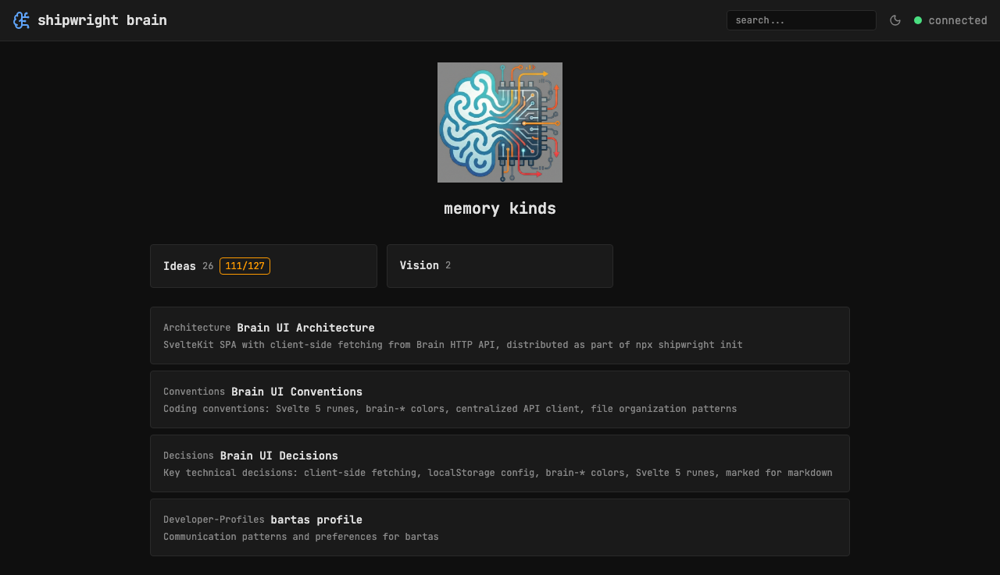
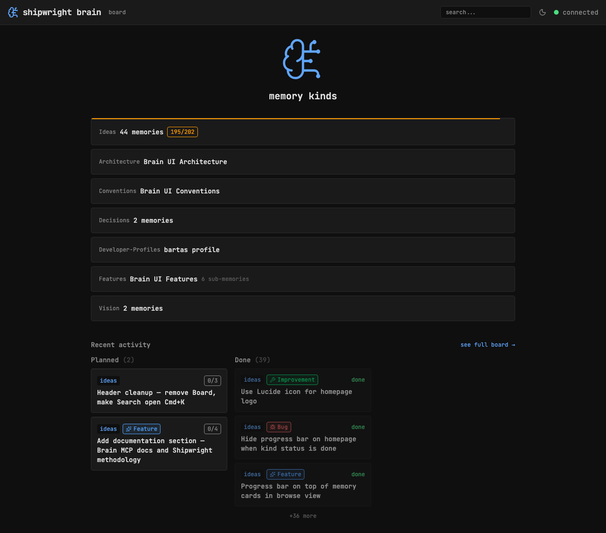

## Background

The homepage currently uses a custom/emoji-based logo. Lucide icons are already used throughout the UI (header, error page, etc). Using a Lucide icon for the homepage logo would keep things consistent.

## Key Points

- [x] Replace hero PNG with Lucide `BrainCircuit` icon on the homepage (same as header, h-24 w-24, brain-accent color, strokeWidth 1.2)
- [x] ~~Incorrectly marked as superseded — developer confirmed this is still wanted~~

