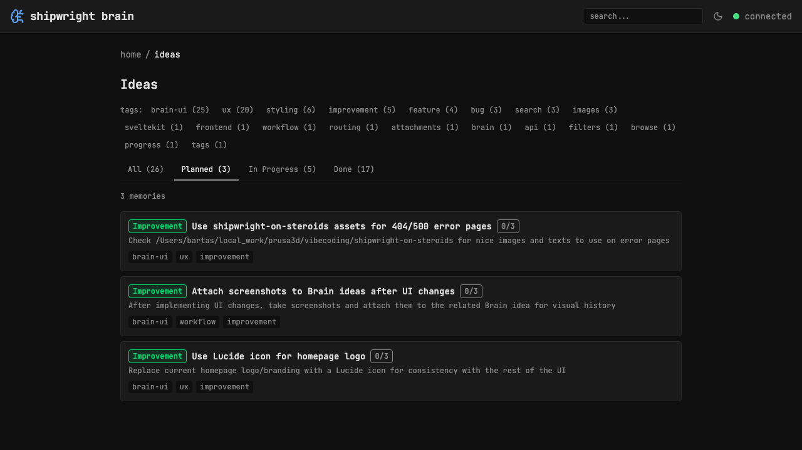
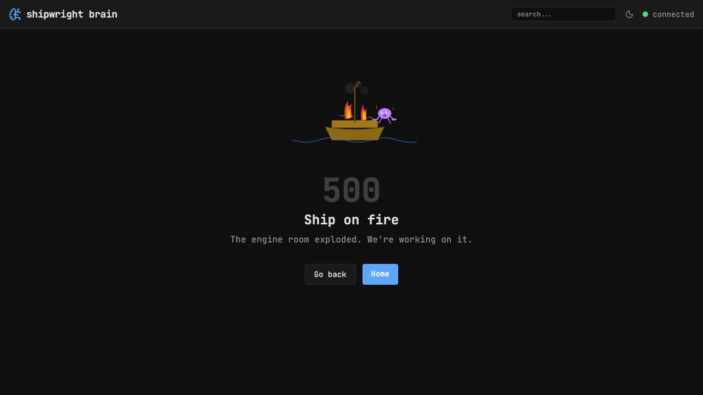
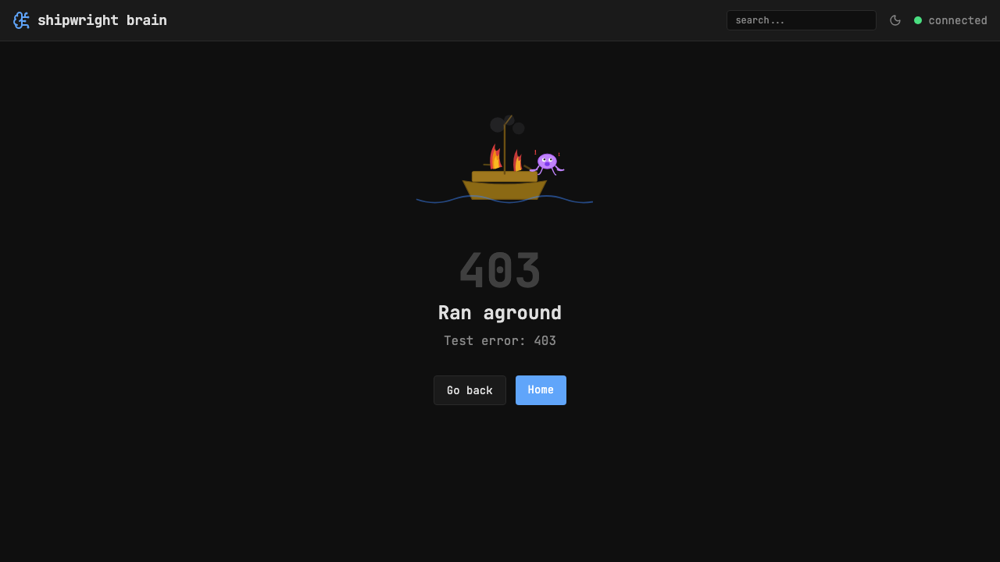
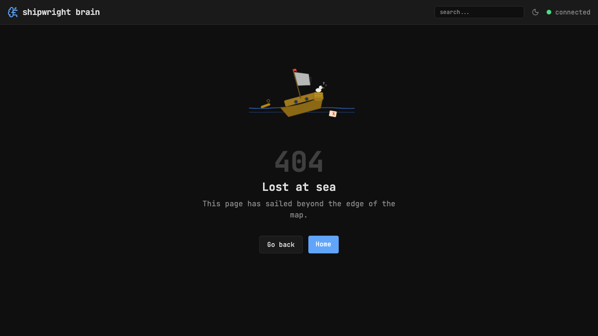

## Background

The shipwright-on-steroids project at `/Users/bartas/local_work/prusa3d/vibecoding/shipwright-on-steroids` may have nice images and themed texts that could be reused for Brain UI error pages. Currently we have hand-crafted SVG illustrations (sinking ship for 404, ship on fire for 500) — could be improved with better assets.

## Key Points

- [x] Check shipwright-on-steroids for reusable error page assets
- [x] Evaluate if their images/texts are better than current SVGs
- [x] Adapt any assets to work with transparent backgrounds for dark/light theme support

## Current State

We already have: `+error.svelte`, `error-404.svg` (sinking ship), `error-500.svg` (ship on fire), `error-generic.svg` (ship on rocks). These are animated SVGs with transparent backgrounds.

